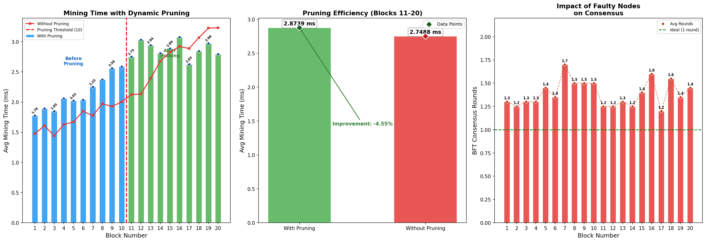

# Blockchain-Based VANET Simulation

A unified simulation of a Vehicular Ad-hoc Network (VANET) secured by a lightweight blockchain, featuring BFT consensus, smart-contract-based Intrusion Detection Systems (IDS), and dynamic chain pruning.

## Overview

This project implements a private blockchain architecture tailored for VANETs to ensure the security, integrity, and privacy of Basic Safety Messages (BSMs) exchanged between vehicles. 

Key features include:
1. **PBFT-style Consensus:** Roadside Units (RSUs) act as block proposers, while vehicles participate as BFT voters. Consensus requires > 2/3 honest agreement.
2. **Smart-Contract IDS:** An on-chain Intrusion Detection System validates incoming BSMs (speed, acceleration, heading, location) against configured thresholds before they are mined into the block.
3. **Dynamic Pruning:** To maintain performance, the blockchain dynamically archives older blocks once a configurable threshold is reached. This significantly reduces the validation overhead for subsequent blocks.
4. **RSU as High-Trust Validators:** RSUs are always trusted and serve as block leaders, reflecting their stationary, high-trust role in real VANET infrastructure.

## Architecture

* `main.py`: The entry point that orchestrates the simulation, blockchain core, BFT consensus, and generates the performance plots.
* `bsm_data.py`: Generates simulated Basic Safety Messages (BSMs) following the SAE J2735 standard subset.
* `smart_contract.py`: Contains the `IntrusionDetectionContract` which validates transaction payloads to catch anomalous or malicious vehicle behavior.

## Usage

Ensure you have Python 3 installed along with `numpy` and `matplotlib`.

```bash
pip install numpy matplotlib
python main.py
```

The script will run the simulation across multiple trials, generate an IDS report, and output a visualization of the results.

## Simulation Results

The simulation generates three key visualizations:
1. **Mining Time with Dynamic Pruning:** Shows how dynamic pruning stabilizes block mining times by capping the active chain validation overhead.
2. **Pruning Efficiency:** A direct comparison of average mining times with and without pruning active.
3. **Impact of Faulty Nodes on Consensus:** Shows the number of BFT rounds required to reach consensus when a variable ratio of nodes are faulty.


